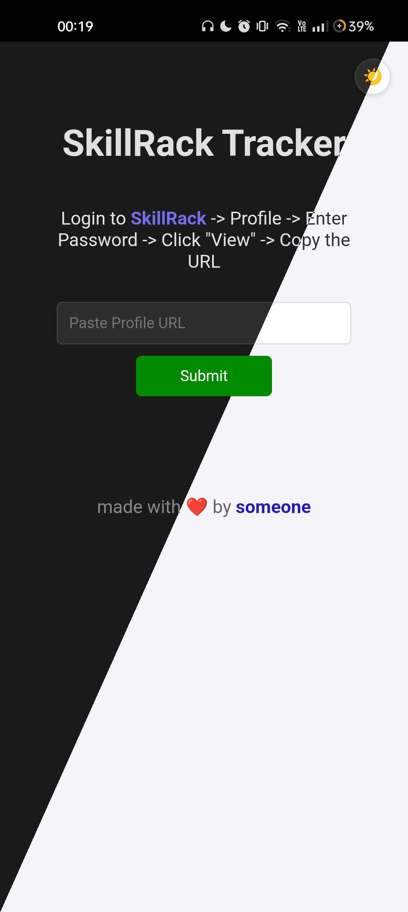
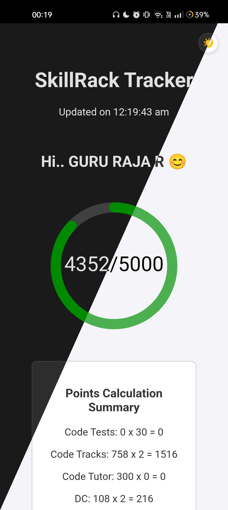
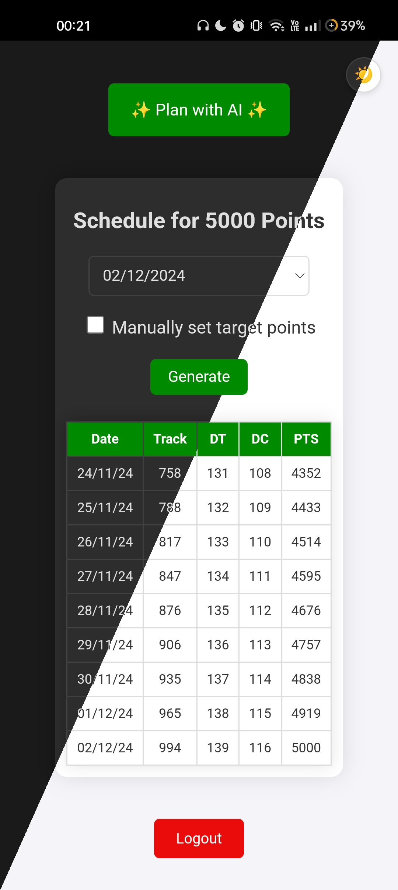
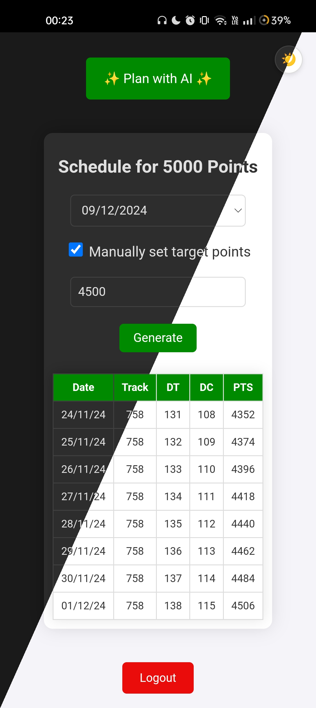
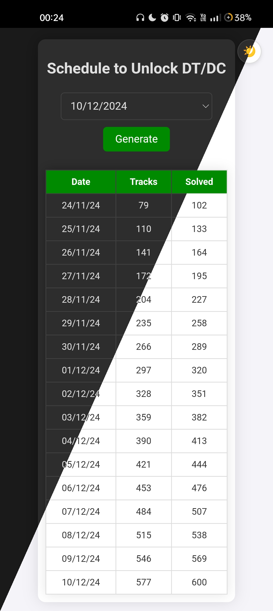

# SkillRack Tracker

Track and calculate your SkillRack points effortlessly with this powerful Progressive Web App (PWA), built using React, Express, Node.js, Axios, and Cheerio. Whether you’re using it on the web as a PWA or as a native Android app packaged with a Trusted Web Activity (TWA), this project scrapes user data from SkillRack, calculates points, and displays them with a progress bar, providing a seamless experience across platforms.

## Features

- Scrapes user data from SkillRack.
- Calculates points based on the user's activities.
- Displays points with a circular progress bar.
- Schedule Planning
- Public API ⚡️

## Download
  
[](https://github.com/Guru-25/SkillRack-Tracker/releases)
[](https://apt.izzysoft.de/fdroid/index/apk/in.gururaja.skillrack)

<p>
  <a href="#support-the-project">
    
  </a>
</p>

> [!NOTE]  
> The app is not yet published on Google Play as the Google Developer account requires a $25 (~₹2100 INR) fee. Clicking the button will take you to a donation link. If you can contribute, your support is appreciated!

## Screenshots

     

## Tools and Technologies

- **React**: Frontend user interface.
- **Express**: Backend API.
- **Node.js**: Server-side runtime environment.
- **Axios**: HTTP client for making requests.
- **Cheerio**: HTML scraping and parsing.
- **react-circular-progressbar**: Progress bar component for React.
- **js-cookie**: Handling cookies in the browser.
- **dotenv**: Managing environment variables.

## API Documentation

The SkillRack Tracker API allows you to track and calculate points based on activities from SkillRack. Below is the documentation for the available endpoints.

### Base URL
```
https://skillrack.gururaja.in/api/points
```

### Endpoints

#### 1. **POST /**

**Description:** Track SkillRack points by processing a provided URL and scraping the relevant data.

- **Endpoint:**
  ```
  POST / 
  ```

- **Request Body:**
  - `url` (string, required): The URL to scrape data from. If the URL is not a direct link to a resume, the API will handle redirections to fetch the correct URL.

  Example:
  ```json
  {
    "url": "http://www.skillrack.com/profile/<resumeId>/<resumeKey>"
  }
  ```

- **Response:**

    ```json
    {
      "id": "<resumeId>",
      "name": "GURU RAJA R",
      "dept": "IT",
      "year": "2026",
      "college": "Thiagarajar College of Engineering (TCE), Madurai",
      "codeTutor": 300,
      "codeTrack": 730,
      "codeTest": 0,
      "dt": 119,
      "dc": 95,
      "points": 4030,
      "requiredPoints": 5000,
      "percentage": 80.60000000000001,
      "lastFetched": "2:36:00 pm",
      "url": "https://www.skillrack.com/faces/resume.xhtml?id=<resumeId>&key=<resumeKey>"
    }
    ```

#### 2. **GET /refresh**

**Description:** Refresh the data for a given URL by re-scraping and re-calculating the points.

- **Endpoint:**
  ```
  GET /refresh
  ```

- **Query Parameters:**
  - `url` (string, required): The URL to refresh data from.

  Example:
  ```
  https://skillrack.gururaja.in/api/points/refresh?url=https://www.skillrack.com/faces/resume.xhtml?id=<resumeId>%26key=<resumeKey>
  ```

- **Response:**

    ```json
    {
      "id": "<resumeId>",
      "name": "GURU RAJA R",
      "dept": "IT",
      "year": "2026",
      "college": "Thiagarajar College of Engineering (TCE), Madurai",
      "codeTutor": 300,
      "codeTrack": 730,
      "codeTest": 0,
      "dt": 119,
      "dc": 95,
      "points": 4030,
      "requiredPoints": 5000,
      "percentage": 80.60000000000001,
      "lastFetched": "2:36:00 pm",
      "url": "https://www.skillrack.com/faces/resume.xhtml?id=<resumeId>&key=<resumeKey>"
    }
    ```

### Example Use Cases

1. **Tracking Points for a New User**

   Send a POST request to the `/` endpoint with the user's SkillRack profile URL. The API will return the user's points and other details.

   ```bash
   curl -X POST https://skillrack.gururaja.in/api/points/ \
   -H "Content-Type: application/json" \
   -d '{"url": "http://www.skillrack.com/profile/<resumeId>/<resumeKey>"}'
   ```

2. **Refreshing Points Data**

   To refresh the points for a user, send a GET request to the `/refresh` endpoint with the user's SkillRack profile URL as a query parameter.

   ```bash
   curl -X GET "https://skillrack.gururaja.in/api/points/refresh?url=https://www.skillrack.com/faces/resume.xhtml?id=<resumeId>%26key=<resumeKey>"
   ```

## Getting Started

### Prerequisites

- Node.js
- npm

### Installation

1. Clone the repository:
   ```sh
   git clone https://github.com/Guru-25/SkillRack-Tracker.git
   cd SkillRack-Tracker
   ```

2. Install dependencies for the client and server:
   ```sh
   npm run build
   ```

3. Set up your environment variables in a `.env` file in the server directory (optional):

   ```env
   IS_RECORD_ENABLED=true_or_false (default: false)

   ## The following are only required when IS_RECORD_ENABLED is true
   # RECORD
   MONGODB_URI=your_mongodb_uri
   BOT_TOKEN=your_bot_token
   CHAT_ID=your_chat_id
   TOPIC1_ID=your_topic1_id
   TOPIC2_ID=your_topic2_id
   TOPIC3_ID=your_topic3_id
   TOPIC4_ID=your_topic4_id
   ID=your_id
   ```

### Running the Application

1. Start the client:
   ```sh
   cd client
   npm start
   ```

2. Start the server:
   ```sh
   cd server
   node index.js
   ```

3. The application should now be running on `http://localhost:3000`.

## Contributing

Contributions are welcome! Please fork the repository and submit a pull request for review - see the [CONTRIBUTING.md](CONTRIBUTING.md) file for details.

## Support the project

Development is financed by individual user contributions, i.e. you becoming a sponsor or donating ❤️.

- [Become a sponsor](https://github.com/sponsors/Guru-25) on GitHub

  or

  <a href="https://gururaja.in/donate">
      
  </a>
  
> [!NOTE]  
> UPI is only available for Indian users.

## Get help

* [Mail](mailto:mail@gururaja.in)

## License

SkillRack Tracker's code is available under a AGPL v3 license - see the [LICENSE](LICENSE) file for details.
